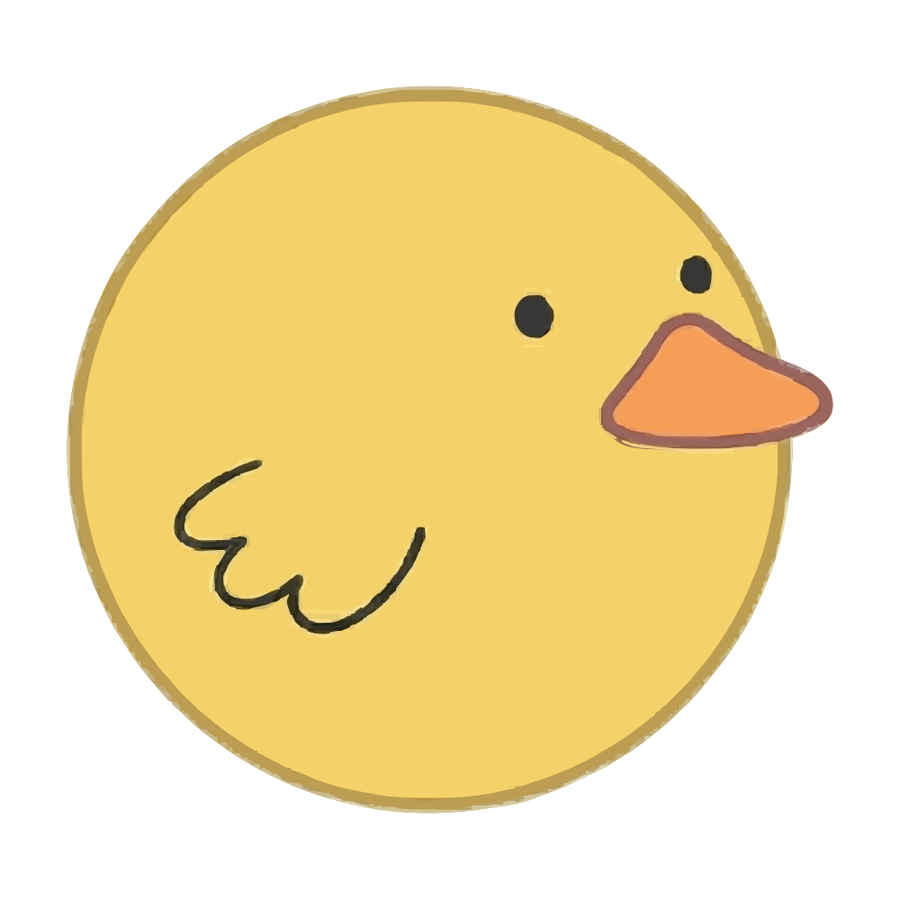

# Ducksy

**AI Productivity Companion**



## Introduction

**Ducksy** is an intelligent desktop companion powered by **Gemini 3** that lives on your screen to help you navigate complex tasks, summarize meetings, and provide real-time assistance.

### Core Value Proposition
- **Always-on assistance** with a friendly animated duck avatar.
- **Seamless desktop integration** with screen and audio context awareness.
- **Global reach** with multi-language support (English, Thai, Japanese, Chinese).

## Key Features

- **🦆 Friendly AI Avatar:** An animated duck companion that makes AI interaction engaging and fun.
- **🧠 Powered by Gemini 3:** Utilizes the latest Gemini models for high-speed, intelligent responses and reasoning.
- **👀 Screen Context Awareness:** Can see and analyze what's on your screen to provide relevant help (via Electron `desktopCapturer`).
- **🎤 Voice Interaction:** Real-time audio input for voice commands and live meeting transcription.
- **🌏 Multi-language Support:** Native support for:
  - English 🇺🇸
  - Thai (ไทย) 🇹🇭
  - Japanese (日本語) 🇯🇵
  - Chinese (中文) 🇨🇳
- **🔒 Privacy-Focused:** Explicit permission management for screen and microphone access.

## Recent Updates 🚀
- **Full Localization:** Complete UI translation for **English 🇺🇸, Thai 🇹🇭, Japanese 🇯🇵, and Chinese 🇨🇳**.
- **Modern Typography:** Implemented hybrid font stack: **Geist** for English and **Prompt** for modern Thai rendering.
- **Enhanced Dashboard:** New **Ghost** (Monitoring) and **Lens** (Capture) modes with localized descriptions.
- **System Tray Support:** App runs in background; Dashboard hides to tray when Overlay is active.
- **Robust Error Handling:** Added **Retry Mechanism** for failed audio/image analysis.
- **Improved UX:** 
  - Settings changes apply instantly with auto-reload.
  - Custom "General" settings section as default.
  - Optimized `.gitignore` and build configuration.

## Development Progress

- [x] **Project Setup:** Initial Electron and Next.js configuration.
- [x] **UI/UX Design:** Implemented onboarding, dashboard, settings, and overlay with "Ghost/Lens" modes.
- [x] **Permission Handling:** System-level permission requests for Microphone and Screen Recording.
- [x] **Gemini 3 Integration:** Connected to Gemini API for real-time transcription and translation.
- [x] **Audio Processing:** Implemented voice recording, saving, and multilingual transcription.
- [x] **Screen Context:** utilizing `desktopCapturer` for visual context (Magic Lens implemented).
- [ ] **Interactive Avatar:** Enhanced idle and reactive animations for Ducksy.

## Tech Stack

- **Frontend / UI:** [Next.js](https://nextjs.org/) (React), [Tailwind CSS](https://tailwindcss.com/)
- **Animations:** [Framer Motion](https://www.framer.com/motion/)
- **Desktop Runtime:** [Electron](https://www.electronjs.org/)
- **Build Tools:** `electron-builder`, `electron-serve`

## Getting Started

### Prerequisites
- Node.js (v18 or higher recommended)
- npm or yarn

### Installation

The project is divided into three parts:
- `ducksy-ui`: The Next.js frontend renderer.
- `ducksy-app`: The Electron main process.
- `ducksy-server`: The backend API server for AI and OAuth.

1.  **Clone the repository:**
    ```bash
    git clone https://github.com/SeanNachapat/Ducksy-Gemini-3-Hackathon-2026.git
    cd Ducksy-Gemini-3-Hackathon-2026
    ```

2.  **Install dependencies:**
    This project uses a root `package.json` to manage workspaces or concurrent scripts.
    ```bash
    npm install
    ```

### Running Development Environment

**Ideally, just run this one command:**

```bash
# From root directory (starts UI + Electron + Server concurrently)
npm run dev
```

If you prefer to run services manually:

1.  **Start Frontend:** `cd ducksy-ui && npm run dev`
2.  **Start Server:** `cd ducksy-server && npm run dev`
3.  **Start App:** `cd ducksy-app && npm run electron`

### Building the Application

To create a distributable installer:

```bash
cd ducksy-app

# Build for macOS (Universal DMG)
npm run build:mac

# Build for Windows (NSIS Installer)
npm run build:win

# Build for All
npm run build:all
```

> **Note:** Building for Windows on macOS requires Wine, or use CI/CD. The build output will be in `ducksy-app/dist/`.

## Project Structure

- `ducksy-ui/`: Contains the Next.js application, React components, pages, and styles.
  - `src/app/page.jsx`: Main onboarding and interface logic.
- `ducksy-app/`: Contains the Electron main process logic.
  - `index.js`: Main entry point, window creation, and IPC handlers (permissions, screen sources).
- `ducksy-server/`: Express.js backend for handling AI requests and OAuth.
  - `routes/`: API and Auth routes.
  - `utils/`: Helper functions and Gemini integration.

## Contributing

Contributions are welcome! Please feel free to submit a Pull Request.

## License

[MIT](LICENSE)

## Environment Variables (.env)

Create a `.env` file in `ducksy-server/` with the following keys:

```ini
# Server Configuration
PORT=8080

# Google Gemini API (Required for AI features)
GEMINI_API_KEY=your_gemini_api_key_here

# Google OAuth (For Calendar Integration)
GOOGLE_CLIENT_ID=your_google_client_id
GOOGLE_CLIENT_SECRET=your_google_client_secret

# Notion Integration (Optional)
NOTION_CLIENT_ID=your_notion_client_id
NOTION_CLIENT_SECRET=your_notion_client_secret
NOTION_REDIRECT_URI=http://localhost:8080/auth/notion/callback
```
